# Quint Specification Agent Workflow

## Complete Workflow

```mermaid
flowchart TB
    User["👤 User Request<br/><i>Add timeout mechanism</i>"]

    subgraph Ana["🔍 analyzer<br/><b>Planning & Analysis</b>"]
        direction TB
        Ana1["📖 Read Current Spec<br/><i>understand structure</i>"]
        Ana2["🔎 Query Quint KB<br/><i>search patterns & examples</i>"]
        Ana3["🧠 Generate Plan<br/><i>detailed refactor strategy</i>"]
        Ana4["✨ Self-Evaluate<br/><i>check plan quality</i>"]
        Ana1 --> Ana2 --> Ana3 --> Ana4
    end

    subgraph Impl["🔧 implementer<br/><b>Implementation & Validation</b>"]
        direction TB
        Impl1["✏️ Apply Changes<br/><i>add types, pure functions, actions</i>"]
        Impl2["🎨 Enforce Patterns<br/><i>State type, thin actions</i>"]
        Impl3["✓ Validate<br/><i>parse + typecheck + iterate</i>"]
        Impl1 --> Impl2 --> Impl3
    end

    subgraph Ver["✅ verifier<br/><b>Testing & Verification</b>"]
        direction TB
        Ver1["🎯 Detect Framework<br/><i>Standard vs Choreo</i>"]
        Ver2["🧪 Design Tests<br/><i>witnesses + invariants + tests</i>"]
        Ver3["▶️ Execute Suite<br/><i>quint test + quint run</i>"]
        Ver4["📊 Classify Results<br/><i>bugs vs test gaps</i>"]
        Ver5["📝 Generate Report<br/><i>summary + reproduction commands</i>"]
        Ver1 --> Ver2 --> Ver3 --> Ver4 --> Ver5
    end

    User --> Ana1
    Ana4 --> Approval{User<br/>Approves?}
    Approval -->|No| Reject["❌ Rejected<br/><i>no changes made</i>"]
    Approval -->|Yes| Impl1
    Impl3 --> ValOK{Validation<br/>Pass?}
    ValOK -->|No| ValErr["⚠️ Validation Failed<br/><i>iterate & fix (3 attempts)</i>"]
    ValErr --> Impl1
    ValOK -->|Yes| Ver1
    Ver5 --> Result{All Tests<br/>Pass?}

    Result -->|Yes| Success["✅ VERIFIED<br/><b>Spec Approved</b><br/><i>all tests pass<br/>properties hold<br/>witnesses satisfied</i>"]
    Result -->|No| Issues["⚠️ Issues Found"]
    Issues --> IssueType{Issue<br/>Type?}
    IssueType -->|"Spec Bug"| SpecFix["🔧 Fix Spec<br/><i>logic errors, safety violations</i>"]
    IssueType -->|"Test Gap"| TestFix["🧪 Improve Tests<br/><i>missing coverage</i>"]
    SpecFix --> Impl1
    TestFix --> Ver2

    style Ana fill:#e1f5ff,stroke:#01579b,stroke-width:2px
    style Impl fill:#fff4e1,stroke:#e65100,stroke-width:2px
    style Ver fill:#e8f5e9,stroke:#1b5e20,stroke-width:2px
    style Success fill:#c8e6c9,stroke:#2e7d32,stroke-width:3px
    style ValErr fill:#ffcdd2,stroke:#c62828,stroke-width:2px
    style Issues fill:#fff9c4,stroke:#f57f17,stroke-width:2px
    style Approval fill:#f3e5f5,stroke:#4a148c,stroke-width:2px
```



## Agent Responsibilities

### 🔍 analyzer
**Input:** Natural language change request + spec files
**Process:**
- Query Quint KB for patterns
- Analyze current spec structure
- Generate detailed refactor plan
- Self-evaluate plan quality
- Present plan for user approval

**Output:** requirement-analysis.json + spec-structure.json + refactor-plan.json
**Reference:** `guidelines/planning.md`

---

### 🔧 implementer
**Input:** Approved refactor plan + spec files
**Process:**
- Apply changes (types, state vars, actions)
- Enforce Quint patterns
- Validate with parse + typecheck
- Iterate on failures (up to 3 attempts)

**Output:** Refactored .qnt spec
**Reference:** `guidelines/iteration.md`, `guidelines/implementation.md`

---

### ✅ verifier
**Input:** Refactored spec
**Process:**
- Detect framework (Standard vs Choreo)
- Design test suite (witnesses + invariants + tests)
- Execute verification (quint run + quint test)
- Classify results (bugs vs test gaps)
- Generate comprehensive report

**Output:** Test files + verification report
**Reference:** `guidelines/verification.md`

---

## Quick Usage

```bash
# Full pipeline
"Add [feature] to specs/file.qnt"
→ analyzer → [user approval] → implementer → verifier

# Skip analysis (have plan)
"Implement and verify refactor-plan.json"
→ implementer → verifier

# Verify only
"Verify specs/file.qnt"
→ verifier
```

## Key Features

- **Plan Approval:** User reviews refactor plan before implementation
- **Self-Evaluation:** Agents check their own work quality
- **Iteration:** 3-attempt loops for error recovery
- **Guidelines:** Detailed strategies available as reference materials
